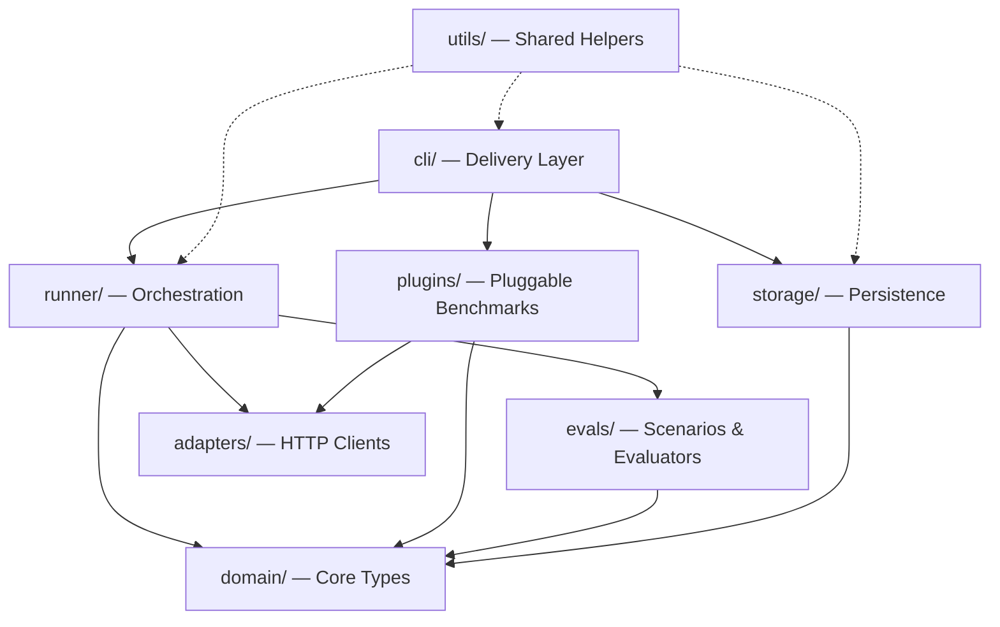

# Architecture

This document describes the internal architecture of `tool-eval-bench`.
For contributor conventions and quality bar, see [AGENTS.md](../AGENTS.md).
For adding new scenarios, see [CONTRIBUTING.md](../CONTRIBUTING.md).

---

## Layered Architecture



### Dependency Rules

| Layer | May Import | Must NOT Import |
|---|---|---|
| `domain/` | stdlib only | storage, adapters, runner, cli, evals |
| `evals/` | domain | storage, adapters, runner, cli |
| `runner/` | domain, evals, adapters (via interfaces) | storage, cli |
| `plugins/` | domain, adapters (via interfaces) | storage, cli, runner, evals |
| `storage/` | domain | adapters, runner, cli, evals |
| `cli/` | everything (delivery layer) | — |
| `utils/` | stdlib, domain | storage, adapters, runner, cli, evals |

---

## Module Reference

### `domain/` — Core Types

The domain layer defines all data structures and contracts. It has zero
external dependencies.

| Module | Purpose |
|---|---|
| `scenarios.py` | `ScenarioDefinition`, `ScenarioEvaluation`, `ScenarioState`, `Category` enum, scoring functions, safety gating |
| `models.py` | `BenchmarkConfig` dataclass |
| `plugin.py` | `BenchmarkPlugin` ABC + `BenchmarkResult` dataclass for pluggable benchmarks |
| `tools.py` | Universal tool definitions (12 tools), system prompt |
| `tools_large.py` | Extended 52-tool definitions for Category L |
| `errors.py` | Structured error code constants |

### `evals/` — Scenarios & Evaluators

Each scenario is a self-contained `ScenarioDefinition` with:
- A **user message** (the prompt)
- A **mock handler** (deterministic tool responses)
- An **evaluator** (scoring logic: pass/partial/fail)

| Module | Categories | Scenarios |
|---|---|---|
| `scenarios.py` | A–E (core 15) + registry | TC-01 – TC-15 |
| `scenarios_extended.py` | F–G | TC-16 – TC-21 |
| `scenarios_agentic.py` | H–K (partial) | TC-22 – TC-50, TC-62–TC-63 |
| `scenarios_adversarial.py` | K (safety extras) | TC-57 – TC-60 |
| `scenarios_large_toolset.py` | L | TC-37 – TC-40 |
| `scenarios_planning.py` | M–N | TC-51 – TC-56 |
| `scenarios_structured.py` | O | TC-64 – TC-69 |
| `scenarios_hardmode.py` | P (opt-in registry) | TC-70 – TC-74 |
| `scenarios_hardmode_expanded.py` | P (opt-in expansion) | TC-75 – TC-84 |
| `helpers.py` | — | Shared evaluator utilities (datetime matching, text scanning, safe math) |
| `noise.py` | — | Deterministic payload enrichment for realistic API noise |

Registries:
- `SCENARIOS` — core 15 (used by `--short`)
- `ALL_SCENARIOS` — full 69
- `ALL_SCENARIOS_WITH_HARDMODE` — full 84

#### Declarative YAML scenarios (pilot)

A small set of scenarios can also be authored as YAML data files under
`evals/yaml_scenarios/`, loaded by `evals/yaml_loader.py`. This is a
low-risk pilot for a future "YAML-first" direction — simple scenarios
(declarative expected tool calls and response rules) can be written without
Python evaluator functions. The existing 84 Python scenarios are the
canonical source for now.

### `runner/` — Orchestration

### `runner/` — Orchestration

| Module | Purpose |
|---|---|
| `orchestrator.py` | Multi-turn tool-call loop (up to 8 turns per scenario) |
| `service.py` | `BenchmarkService` — coordinates orchestrator + storage + reporting |
| `throughput.py` | Built-in streaming pp/tg measurement |
| `speculative.py` | Spec-decode / MTP benchmarking (acceptance rate, effective t/s) |
| `spec_live.py` | Live monitor data layer (Prometheus scraping, delta computation) |
| `llama_benchy.py` | External llama-benchy subprocess integration |
| `context_pressure.py` | Filler generation, calibration, prefix-cache busting |
| `judge.py` | LLM-as-judge for failed scenario analysis (WIP) |
| `async_tools.py` | Async tool execution simulation (polling-style tools) |

### `adapters/` — HTTP Clients

| Module | Purpose |
|---|---|
| `base.py` | `ModelAdapter` ABC |
| `openai_compat.py` | `OpenAICompatibleAdapter` — single adapter for vLLM, LiteLLM, llama.cpp, SGLang |

All backends use the same adapter; the `--backend` flag is a label for reports.

### `plugins/` — Pluggable Benchmarks

Each plugin implements `domain.plugin.BenchmarkPlugin` and owns its own
dataset loading, evaluation, and report rendering.

| Plugin | Dataset | Questions |
|---|---|---|
| `gsm8k/` | `openai/gsm8k` | 1,319 math reasoning |
| `mmlu/` | `cais/mmlu` | 14,042 multitask (57 subjects) |
| `ifeval/` | `google/IFEval` | 541 instruction following |

Shared infrastructure:
- `hf_utils.py` — HuggingFace downloader (retry, resume, throttle, `datasets` library fast-path)
- `registry.py` — `get_plugin()` / `available_plugins()` lookup

### `storage/` — Persistence

| Module | Purpose |
|---|---|
| `db.py` | `RunRepository` — SQLite persistence for run results |
| `reports.py` | `MarkdownReporter` — generates `runs/YYYY/MM/<run_id>.md` reports |

### `cli/` — Delivery Layer

| Module | Purpose |
|---|---|
| `bench.py` | Main CLI entry point (`tool-eval-bench` command). After the 2026 refactor, this is dispatch-only — argument parsing, the `main()` routine, and the plugin benchmark runners. |
| `commands.py` | Scenario resolution (`resolve_scenarios`, `resolve_all_scenarios_for_ids`) |
| `helpers.py` | Small CLI helpers: dotenv loading, URL redaction, JSON output, sweep/int parsing, plugin-run persistence, headless errors |
| `server.py` | Server discovery and backend detection from response headers (`discover_server`, `detect_backend_from_response`) |
| `perf.py` | Throughput runners: `run_throughput` (built-in), `run_llama_benchy` (external) |
| `spec_bench.py` | Speculative-decoding / MTP benchmark runner |
| `pressure.py` | Context-pressure sweep runner |
| `display.py` | Zero-flicker streaming Rich display for scenario progress |
| `history.py` | `--history`, `--compare`, `--diff` rendering |
| `leaderboard.py` | `--leaderboard`, `--export` rendering |
| `spec_live_display.py` | Live spec-decode Textual dashboard |
| `spec_live_rendering.py` | Rich component rendering for spec-live |

### `utils/` — Shared Helpers

| Module | Purpose |
|---|---|
| `ids.py` | Unique run IDs and deterministic configuration fingerprints |
| `metadata.py` | System/backend metadata collection (engine probing) |
| `urls.py` | URL construction, redaction, header helpers |

---

## Data Flow

### Tool-Call Benchmark

```
CLI (bench.py)
  │
  ├─ parse args → BenchmarkConfig
  ├─ create OpenAICompatibleAdapter
  ├─ create BenchmarkService(repo, reporter)
  │
  └─ service.run_benchmark()
       │
       ├─ for each scenario in resolved list:
       │    │
       │    ├─ orchestrator.run_scenario(scenario, adapter, config)
       │    │    │
       │    │    ├─ build messages: system + context + user + [pressure filler]
       │    │    ├─ loop (up to max_turns):
       │    │    │    ├─ adapter.chat_completion(messages, tools)
       │    │    │    ├─ if tool_calls: execute via scenario.handle_tool_call()
       │    │    │    ├─ noise.enrich_payload(result)
       │    │    │    └─ append tool results to messages
       │    │    │
       │    │    └─ scenario.evaluate(state) → ScenarioEvaluation
       │    │
       │    └─ yield ScenarioResult
       │
       ├─ compute scores (scenario-count-weighted)
       ├─ apply safety gate (Category K < 50% → cap rating)
       │
       ├─ repo.save(run)           # SQLite
       └─ reporter.write(run)      # Markdown
```

### Plugin Benchmark (GSM8K/MMLU/IFEval)

```
CLI (bench.py)
  │
  ├─ registry.get_plugin("gsm8k")
  ├─ plugin.run(adapter, config)
  │    │
  │    ├─ dataset.load()           # HF datasets lib or REST API
  │    ├─ for each question:
  │    │    ├─ build few-shot prompt
  │    │    ├─ adapter.chat_completion(messages)
  │    │    ├─ evaluator.extract_answer(response)
  │    │    └─ evaluator.check(extracted, expected)
  │    │
  │    └─ BenchmarkResult(accuracy, breakdown, ...)
  │
  └─ render report (terminal + Markdown)
```

---

## Extension Points

### Adding a New Scenario
See [CONTRIBUTING.md](../CONTRIBUTING.md#adding-a-new-scenario).

### Adding a New Plugin Benchmark
1. Create `plugins/<name>/` with `dataset.py`, `evaluator.py`, `plugin.py`
2. Implement `BenchmarkPlugin` ABC from `domain/plugin.py`
3. Register in `plugins/registry.py`
4. Add CLI flags in `cli/bench.py`

### Adding a New Backend
All backends use `OpenAICompatibleAdapter`. To support a new backend:
1. Ensure it exposes `/v1/chat/completions` with `tools` support
2. Add a port to auto-discovery in `cli/bench.py`
3. Add backend name to the `--backend` choices

---

## Test Architecture

| Layer | Test Files | Count |
|---|---|---|
| Evaluator contract | `test_evaluator_contract.py` | Golden-trace PASS/FAIL/PARTIAL for TC-01–TC-15 |
| Evaluator coverage | `test_evaluators_extended.py`, `test_hardmode.py`, `test_structured_output.py`, `test_planning_scenarios.py` | Extended scenarios F–P |
| Evaluator robustness | `test_evaluator_robustness.py` | Crash resistance, edge cases |
| Plugin evaluators | `test_gsm8k_evaluator.py`, `test_mmlu_evaluator.py`, `test_ifeval_checkers.py` | Answer extraction, constraint checking |
| Runner | `test_orchestrator.py`, `test_throughput.py`, `test_speculative.py`, `test_spec_live.py` | Orchestration, measurement |
| Storage | `test_reporter.py`, `test_history.py`, `test_storage_metadata.py` | Persistence, reports |
| CLI | `test_display.py`, `test_leaderboard_display.py`, `test_e2e.py` | Display rendering, E2E flows |
| API | `test_api.py`, `test_plugin_interface.py` | Programmatic API, schema drift |
| Adapter | `test_adapter.py` | SSE streaming, normalize, parse, error handling (httpx mocks) |

**Total: 1,706 tests, 64% line coverage, 1.9s runtime.**
